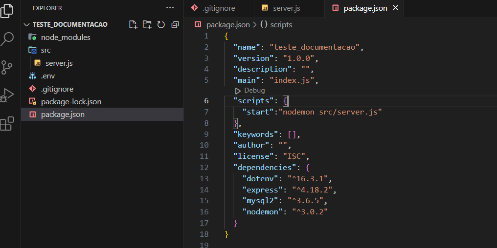

# Documentação  para construção de API com NodeJS
* Escolher local do computador para criar a pasta do projeto
* Abrir o gitBash nesta pasta
```
mkdir NOME_PROJETO
```
Acessar a pasta do projeto
```
cd NOME_PROJETO
```
Abrir a pasta no VSCode 
```
code .
```
Iniciar o gerenciador de pacotes Node
```
npm init -y
```
* Cria o arquivo package.json para gerenciar os pacotes da aplicação

# Instalar pacotes da API
```
npm i express nodemon dotenv mysql2
```
* espress: será o servidor da api
* nodemon: atualizar os arquivos alterados sem parar o servidor 
* dotenv: gerenciador de variáveis de ambiente
* mysql2: integrar aplicação com o banco de dados

Criar arquivo .gitignore
```
touch .gitignore
```
* Arquivo responsável por ignorar arquivos e pastas no gitHub, ou seja, não serão visíveis no repositório remoto

Criar arquivo .env: armazenará as variáveis do ambiente
```
touch .env
```

Criar arquivo .env.example
```
touch .env.example
```
* Arquivo responsável definir as variáveis de ambiente sem o valores

Colar as variáveis no arquivo '.env.example'
```
# DEFINIÇÂO DA PORTA DO SERVIDOR EXPRESS
PORT =

# VARIÁVEIS DE CONEXÃO COM BANCO
DB_HOST =
DB_USER =
DB_PASSWORD =
DB_DATABASE =
DB_PORT =
```
* Por padrão o pacote mysql2, espera a conexão com banco na porta 3306
* Se o MySQL não foi instalado na porta 3306, precisamos informar a porta do MySQL no arquivo '.env' e recuperar no arquivo "db.js" para acessar o banco


Informar arquivos e pastas no .gitignore
```
node_modules
.env
```
Criar pasta src para estrutura do projeto
```
mkdir src
```
* Pasta responsável por organizar a estrutura da aplicação

Criar arquivo server.js na pasta src
```
touch src/server.js
```
* Arquivo responsável por rodar a aplicação

Colar o código de configuração no arquivo 'server.js'
```
// Importar o arquivo de configuração
const app = require('./app');
// Importar a porta do servidor
const port = app.get('port');

// Testar servidor
app.listen(port, () => console.log(`Running at port ${port}`));
```

Criar arquivo app.js na pasta src
```
touch src/app.js
```
* Arquivo responsável por configurar a aplicação

Colar o código de configuração no arquivo 'app.js'
```
// Importar pacote do express
const express = require('express');
// Instanciar o express na variavel app
const app = express();
app.use(express.json());

// importar as rotas para serem executadas na aplicação
const crudRouter = require('./routes/crudRouter');
// importar as rotas para serem executadas na aplicação
const alunosRouter = require('./routes/alunosRouter');

// Importar o pacote dotenv
const dotenv = require('dotenv').config();

// Habilitar a utilização do crudRouter
app.use('/api', crudRouter);
// Habilitar a utilização do alunosRouter
app.use('/api', alunosRouter);

//Setar a porta do servidor, a partir do arquivo .env
app.set('port', process.env.PORT);

// Exportar as configurações do app para outros arquivos acessarem
module.exports = app;
```

Criar comando para rodar o servidor, no arquivo 'package.json'
```
"start":"nodemon src/server.js"
```
* Substituir o comando "test" dentro da chave scripts pelo comando start acima
* Este comando é responsável por rodar a API 

Após esta configuração o arquivo 'package.json' deve estar conforme a imagem abaixo




Rodar o comando no terminal com gitBash
```
npm run start
```
Parar o server no terminal com gitBash
```
Ctrl + C
```

## Criar estrutura para o projeto
Criar arquivo app.js na pasta src
```
touch src/app.js
```

## Rodar o comando 'npm install' sempre que fizer um clone do gitHub

## Criar o arquivo .env e .env.example
```
touch .env
```
* Criar arquivo para salvar as variáveis necessárias da aplicação sem os valores
```
touch .env.example
```

* Criar pasta routes
```
mkdir routes
```

* Criar arquivo crudRouter.js dentro da pasta routes
```
nano crudRouter.js
```
### Ctrl + O: Salvar o arquivo
### Enter: Confirmar nome do arquivo
### Ctrl + X: Fechar o arquivo

* Digitar o código no arquivo criado
```
/// Importar pacote do express
const { Router } = require('express');
// Instanciar o Router na variavel router
const router = Router();
// Importar funções do controller para a rota acessar as funções
const { 
    listarDados,
    gravarDados,
    atualizarDados,
    deletarDados
 } = require('../controllers/controller');

router.get('/listar', listarDados);

router.post('/gravar', gravarDados);

router.put('/atualizar/:id', atualizarDados);

router.delete('/deletar/:id', deletarDados);

module.exports = router;
```

### CRIAÇÃO DE CONTROLLERS
* Arquivos para processar as requisições das rotas

<hr>

### Criar pasta de controllers
```
mkdir src/controllers
```

### Criar arquivo controller.js
```
touch src/controllers/controller.js
```

### Criar funções para processar as requisições da rotas

```
function listarDados(request, response) {
    response.send('Retorno de lista de informação do Banco de dados');
}

function gravarDados(request, response) {
    response.send('Método utilizado para salvar informações!');
}

function atualizarDados(request, response) {
    response.send('Método utilizado para editar informações!');
}

function deletarDados(request, response) {
    response.send('Método utilizado para deletar informações!');
}

module.exports = {
    listarDados,
    gravarDados, 
    atualizarDados, 
    deletarDados
}
```
<hr>

## Configurar estrutura de conexão com banco de dados 

### Criar pasta 'config' dentro da pasta 'src'
```
mkdir src/config
```
### Criar arquivo 'db.js' dentro da pasta 'config'
```
touch src/config/db.js
```
### Colar o código no arquivo 'db.js'
```
// Importanto o pacote de conexão com banco de dados
const mysql = require('mysql2');
// Importar variaveis de conexão do banco
require('dotenv').config();

console.log(process.env.DB_HOST);

const connection = mysql.createConnection({
    host: process.env.DB_HOST,
    user: process.env.DB_USER,
    password: process.env.DB_PASSWORD,
    database: process.env.DB_DATABASE
});

connection.connect( (err) => {
    if (err) {
        console.log('Erro de conexão: ' + err);
    } else {
        console.log('Mysql Connected!');
    }
});

module.exports = connection;
```

## Criar banco de dados

* Criar database
* Dar um use na database criada
* Criar tabelas

### Criar database
```
create database NOME_DATABASE;
```
* CTRL + Enter: executa o comando sql

### Selecionar a database
```
use NOME_DATABASE;
```

### Criar tabela alunos
```
create table alunos(
    id int not null auto_increment,
    nome varchar(120) not null,
    dt_nascimento date not null,
    time_do_coracao varchar(120),
    primary key(id)
);
```

### Criar tabela users
```
create table users(
    id int not null auto_increment,
    ds_nome varchar(120),
    primary key(id)
);
```